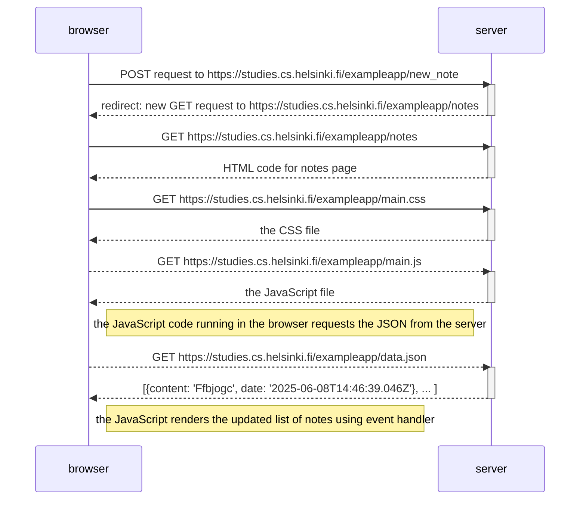

```mermaid
    sequenceDiagram
        participant browser
        participant server

        browser->>server: POST request to https://studies.cs.helsinki.fi/exampleapp/new_note
        activate server
        server-->>browser: redirect: new GET request to https://studies.cs.helsinki.fi/exampleapp/notes
        deactivate server

        browser->>server: GET https://studies.cs.helsinki.fi/exampleapp/notes
        activate server
        server-->>browser: HTML code for notes page
        deactivate server

        browser->>server: GET https://studies.cs.helsinki.fi/exampleapp/main.css
        activate server
        server-->>browser: the CSS file
        deactivate server

        browser-->>server: GET https://studies.cs.helsinki.fi/exampleapp/main.js
        activate server
        server-->>browser: the JavaScript file
        deactivate server

        Note right of browser: the JavaScript code running in the browser requests the JSON from the server

        browser-->>server: GET https://studies.cs.helsinki.fi/exampleapp/data.json
        activate server
        server-->>browser: [{content: 'Ffbjogc', date: '2025-06-08T14:46:39.046Z'}, ... ]
        deactivate server

        Note right of browser: the JavaScript renders the updated list of notes using event handler
```